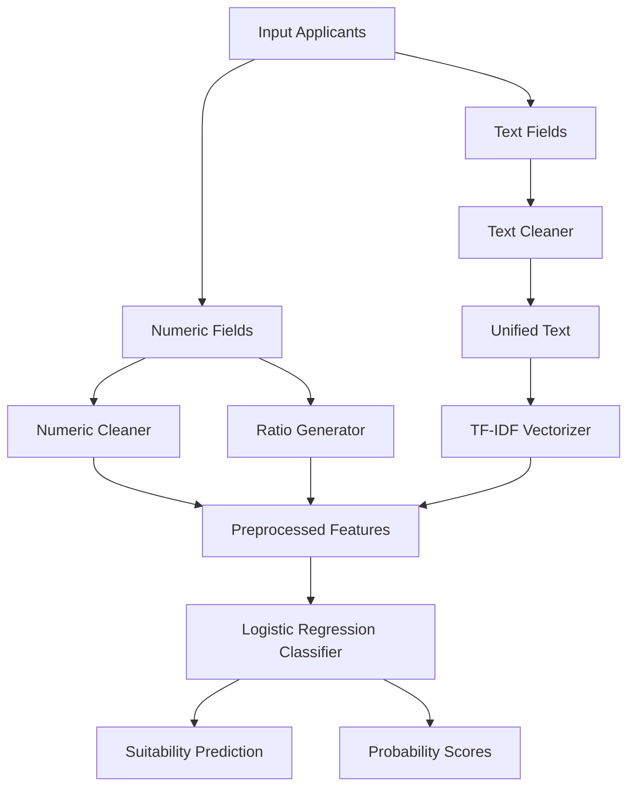

#  **Grant Suitability Prediction System**

*A Machine Learning Pipeline for Assessing Organizational Readiness for Grants*

This project builds an end-to-end machine learning system that predicts an organization’s grant suitability classification (Low, Medium, High) using both structured financial indicators and unstructured proposal text. The pipeline is designed to support development programs, philanthropy, and grantmaking institutions that require consistent, transparent decision-support tools.

The system integrates numeric preprocessing, financial ratio engineering, text cleaning, TF-IDF vectorization, and logistic regression classification into a unified reproducible ML workflow.


#  **Features**

* Handles **numeric + narrative text** simultaneously
* Generates **five financial resilience ratios** automatically
* Normalizes and vectorizes text using **TF-IDF**
* Hybrid ML–NLP pipeline using scikit-learn
* Fully modular preprocessing design
* Easy-to-run `train.py` and `predict.py` scripts
* Prepared for future integration with real calls for proposals

---

# 📂 **Repository Structure**

```bash
grant-ml/
│
├── data/
│   ├── raw/                 # Raw datasets (manual uploads)
│   ├── new/                 # Optional: new calls for proposals
│   ├── processed/           # Cleaned and transformed data
│   └── train.csv            # Primary training dataset
│
├── src/
│   ├── preprocessing/
│   │   ├── text_cleaner.py
│   │   ├── numeric_cleaner.py
│   │   ├── ratio_preprocessor.py
│   │   ├── dataframe_wrapper.py
│   │   └── full_preprocessor.py
│   │
│   └── models/
│       ├── train.py
│       └── predict.py
│
└── notebooks/
    ├── testing_preprocessor.ipynb
    └── exploration.ipynb
```

---

# 🧮 **Financial Health Ratios**

To reflect real grantmaking due diligence processes, the system computes five domain-relevant financial ratios:

### **1. Grant Absorption Capacity**

[
\text{Absorption} = \frac{\text{Past Grants Total}}{\text{Annual Budget} + \epsilon}
]

Measures how well the organization has historically used external funding.

---

### **2. Financial Dependency Ratio**

[
\text{Dependency} = \frac{\text{Past Grants Total}}{\text{Total Revenue} + \epsilon}
]

Assesses how much the organization depends on donor income.

---

### **3. Budget Leverage Ratio**

[
\text{Leverage} = \frac{\text{Annual Budget}}{\text{Annual Budget Last Year} + \epsilon}
]

Captures year-over-year financial growth.

---

### **4. Liquidity Ratio**

[
\text{Liquidity} = \frac{\text{Cash Reserves}}{\text{Monthly Operating Expenses} + \epsilon}
]

Reflects operational security and financial resilience.

---

### **5. Organizational Stability Ratio**

[
\text{Stability} = \frac{\text{Years Active}}{(\text{Past Grants Total} + \epsilon)}
]

A proxy for maturity relative to grant history.

---

# 🧰 **Pipeline Overview**

The system uses a three-part preprocessing pipeline:

### **1. Numeric Pipeline**

* Clean numeric fields
* Remove symbols/currency
* Impute missing values
* Scale using StandardScaler

### **2. Ratio Pipeline**

* Compute 5 ratios
* Impute + scale

### **3. Text Pipeline**

* Clean text columns
* Lowercase + remove punctuation + remove stopwords
* Merge multi-field text
* Convert to TF-IDF vectors

All components integrate into a single `ColumnTransformer`, feeding directly into the model.

---

# 🤖 **Model Choice and Technical Rationale**

This project uses a hybrid ML–NLP setup designed for accuracy, transparency, and academic defensibility.

---

## 🧠 **1. Logistic Regression (Primary Classifier)**

Logistic Regression is used because it:

* Produces **probabilities** (Low/Medium/High suitability)
* Works extremely well with **TF-IDF text vectors**
* Performs strongly on **small-to-medium datasets**
* Is highly **interpretable**, a key requirement for grantmaking transparency
* Integrates cleanly with numeric features and engineered ratios

This makes it ideal for an MVP and academically aligned with explainability norms.

---

## 💬 **2. TF-IDF for Text Vectorization**

TF-IDF converts narrative text (project descriptions, track records, mission statements) into numerical meaning vectors.

Chosen because it:

* Performs well on grant narrative text
* Does not require massive GPU resources
* Works perfectly with linear models like Logistic Regression
* Allows the model to detect key themes (capacity, governance, livelihoods, climate, community impact)

---

## 📊 **3. Financial Ratio Engineering**

Five financial resilience ratios are computed to capture organizational strength beyond raw numeric values. These add signal relevant to:

* Sustainability
* Liquidity
* Risk management
* Institutional maturity
* Historical grant success

These ratios represent measurable proxies that grantmakers frequently assess manually.

---

## 🚀 **4. Alternative Future Models (When More Data Is Available)**

### **A. XGBoost / LightGBM**

* Excellent for numeric-heavy, tabular data
* Captures nonlinear patterns
* Could improve performance once dataset scales

### **B. Random Forests**

* More robust than linear models
* Provide feature importance

### **C. Transformer-Based NLP (BERT, SBERT, Longformer)**

* Capture semantic meaning
* Ideal for long proposal documents
* Require larger datasets

### **D. Neural Networks**

* Combine numeric + embeddings
* Useful for richer structured/unstructured data

These are reserved for later phases when more labeled data becomes available.

---


# 🧪 **Training the Model**

Run:

```bash
python src/models/train.py
```

Outputs:

* Training metrics
* Test accuracy
* Saved model (`models/model.pkl`)

---

# 🎯 **Making Predictions**

Run:

```bash
python src/models/predict.py
```

Returns:

```
Suitability Prediction: HIGH
Probabilities: {LOW: 0.12, MEDIUM: 0.33, HIGH: 0.55}
```

You can supply data via dictionary, JSON, or CSV.

---

# 🧩 **System Architecture Diagram**



---


# 🛣️ **Roadmap Summary**

### **✔️ What Has Been Done**

* Full preprocessing pipeline built (numeric cleaner, text cleaner, ratio generator).
* TF-IDF vectorization integrated.
* Logistic Regression model trained using a balanced synthetic dataset.
* Prediction script created (`predict.py`).
* End-to-end pipeline tested successfully in Jupyter.
* README, methods, and documentation written.

---

### **🔧 What Is Ongoing**

* Building the front-end UI for running predictions.
* Preparing SHAP explainability integration.
* Organizing the API structure for deployment (FastAPI).

---

### **🚀 What Is Coming Next**

* Add SHAP explanations (feature importance + text contribution).
* Build full FastAPI backend for predictions and batch scoring.
* Upgrade NLP to transformer-based models (SBERT/BERT/Longformer).
* Support multi-document applications (proposal, budget, workplan, CVs).
* Deploy full application with UI + API + Docker.

> *The system uses an interpretable, hybrid ML–NLP architecture based on TF-IDF vectorization, engineered financial ratios, and logistic regression. This combination provides a transparent baseline model that is suitable for grant assessment contexts while maintaining academic robustness and enabling smooth transition to more complex deep learning approaches in future phases.*

---

# 📜 **License**

MIT License 

---

